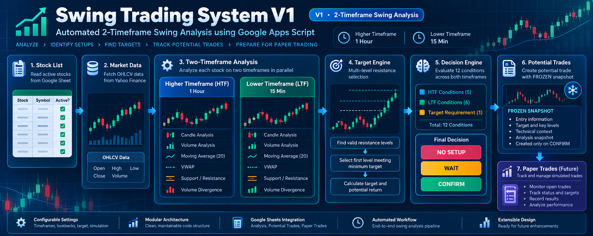

# SwingPilot V1

> **2-Timeframe Swing Analysis + Forward Paper Trading**

A modular **Google Sheets + Google Apps Script** system for analyzing active NSE stocks using a higher timeframe and a lower timeframe, evaluating a structured set of technical conditions, calculating target potential, and creating a **frozen Potential Trade snapshot** only when the configured confirmation gate is satisfied.



## V1 status

**Version:** V1

**Current analysis configuration:**
- Higher Timeframe: **1 Hour**
- Lower Timeframe: **15 Min**
- Candle Lookback: **20**
- Volume Lookback: **20**
- Moving Average Period: **20**
- Minimum Target: **1.50%** for the intended production configuration
- Simulation Mode: **Fixed Amount**
- Simulation Amount: **₹5,000** in the current workbook setup

> During validation, the Minimum Target was temporarily reduced to 1.22% and 1.00% to test multi-level target selection. Those were diagnostic tests, not the intended final V1 setting.

## What the system does

The system follows this pipeline:

```text
Stock_List
   │
   ▼
Yahoo Finance OHLCV Data
   │
   ├───────────────┐
   ▼               ▼
Higher TF       Lower TF
(1 Hour)        (15 Min)
   │               │
   ├─ Candle       ├─ Candle
   ├─ Volume       ├─ Volume
   ├─ MA(20)       ├─ MA(20)
   ├─ S/R          ├─ VWAP
   └─ Structure    └─ S/R
   │               │
   └───────┬───────┘
           ▼
     Volume Divergence
           │
           ▼
      Target Engine
   (multi-level resistance)
           │
           ▼
      Decision Engine
        12 conditions
           │
      ┌────┼─────┐
      ▼    ▼     ▼
 NO SETUP WAIT  CONFIRM
                  │
                  ▼
         Potential Trade
        FROZEN snapshot
                  │
                  ▼
       Paper Trades — Future
```

## Major modules

The V1 codebase is intentionally modular. The completed analysis stack includes:

- Apps Script foundation and custom Google Sheets menu
- Settings and configuration validation
- Stock list / active-stock selection
- Yahoo Finance OHLCV data retrieval
- Candle analysis
- Volume analysis
- Support / resistance analysis
- Moving average analysis
- VWAP analysis
- Volume divergence analysis
- Higher timeframe analysis
- Lower timeframe analysis
- Multi-level target calculation
- 12-condition decision engine
- Analysis orchestration across active stocks
- Potential Trade creation with a frozen snapshot

Paper Trades, Real Portfolio and Dashboard areas are reserved for the next implementation/validation phase where applicable.

## Google Sheet / workbook structure

### Recommended workbook name

**SwingPilot V1 — 2-Timeframe Swing Analysis**

This keeps the name descriptive for both GitHub/portfolio presentation and day-to-day use in Google Sheets.

### Recommended production tabs

| Tab | Purpose | V1 status |
|---|---|---|
| `Settings` | Central configuration | Active |
| `Stock_List` | Input universe and active flags | Active |
| `Analysis` | Full per-stock analysis output | Active |
| `Potential_Trades` | Confirmed potential-trade snapshots | Active |
| `Paper_Trades` | Simulated trade tracking | Next phase |
| `Real_Portfolio` | Future live/portfolio tracking | Reserved |
| `Dashboard` | Future presentation layer | Reserved |
| `Analysis-old` | Historical/old sheet | Archive or hide |

For the V1 freeze, `Analysis-old` should be treated as an archive rather than a production tab. Hiding it is safer than deleting it until the project is fully backed up.

## Current custom menu

The workbook currently exposes:

```text
SwingPilot
├── Test Settings
├── Test Yahoo Data
├── Run Analysis
├── Test Decision Engine
└── Test Potential Trade
```

For a frozen V1, this menu is sufficient and does not need new features.

For a later UI polish pass, `Run Analysis` could be placed first, followed by the test utilities, but that is optional and is not required for the V1 functional freeze.

## Stock input workflow

`Stock_List` is the entry point for the analysis universe. The active-stock workflow is dynamic; the analysis orchestrator reads active rows rather than relying on a hard-coded stock symbol.

Typical fields:

| Field | Example |
|---|---|
| Stock | COALINDIA |
| Yahoo Symbol | COALINDIA.NS |
| Company | Coal India Ltd |
| Sector | Metals/Mining |
| Rank | 1 |
| Active? | YES |

Only stocks marked active are processed by the analysis run.

## Decision model

The Decision Engine evaluates **12 conditions** spanning the higher timeframe, lower timeframe and target requirement.

The V1 decision states are:

### `CONFIRM`

Used only when the defined higher-timeframe bullish setup, lower-timeframe bullish setup and target requirement all satisfy the current gate.

### `WAIT`

Used for a partial setup where some meaningful conditions are satisfied but the required confirmation is incomplete.

### `NO SETUP`

Used when the setup does not meet the required criteria, including cases where target room is insufficient.

The system is intentionally strict: **a stock does not need to produce a Potential Trade during every run**.

## Potential Trades

A Potential Trade is created only after the decision gate produces `CONFIRM`.

The created record stores a **frozen snapshot** of the setup, including entry/target information and the technical context used at creation time. The snapshot is designed not to be overwritten by later market-data changes.

A controlled `TEST.CONFIRM` validation has already demonstrated the intended Potential Trade creation and frozen-snapshot behavior.

## Target Engine validation

V1 originally exposed a target-selection integration gap: the production analysis path could provide only the nearest resistance even though the Target Engine was designed to evaluate multiple resistance levels.

That integration has now been corrected by preserving full `resistanceLevels` in both timeframe analyses and passing those arrays through the Analysis Orchestrator.

Validation with COALINDIA demonstrated the intended behavior:

```text
Nearest resistance levels were below the required target room
                    ↓
Target Engine examined additional resistance levels
                    ↓
A farther resistance level was selected
                    ↓
Target Potential and Target Room were recalculated correctly
```

Example validation runs selected targets such as **436.25** and **435.35** when lower minimum-target thresholds were temporarily used. The final V1 configuration remains **1.50%**.

## External stock screener: how to find better candidates

A stock screener can be useful as a **candidate generator**, but it should not replace this system's final decision engine.

For the current V1 design, **Chartink is the closest technical match among the screeners reviewed** because its scanner supports custom technical filters, multiple timeframes, volume conditions, and VWAP-based scans. Chartink documents VWAP availability across timeframes, and its examples include 15-minute VWAP and volume conditions. citeturn345654search1turn345654search8

TradingView also provides a broad stock screener with technical filters and chart views that map to 15-minute and 1-hour intervals, making it useful for candidate discovery and visual review. citeturn345654search6turn345654search4

Screener.in is useful for combining technical and fundamental filters such as price versus moving averages, volume averages, market capitalization and other company metrics, but the examples reviewed are more oriented toward daily/market-ratio screening than the exact intraday 1-hour/15-minute workflow used by this V1 system. citeturn791808search0turn791808search4

### Suggested two-stage workflow

```text
External Screener
      ↓
Generate a manageable candidate list
      ↓
Stock_List (Active? = YES)
      ↓
SwingPilot V1
      ↓
12-condition analysis + target engine
      ↓
WAIT / NO SETUP / CONFIRM
      ↓
Potential Trade only on CONFIRM
```

A practical pre-screen should look for **broad proxies** of this system's conditions, for example:

- 1-hour price above its 20-period moving average
- 15-minute price above VWAP
- 15-minute price above its 20-period moving average
- recent positive price action
- meaningful or increasing volume
- liquid NSE stocks

These filters can reduce the number of stocks entering `Stock_List`, but they should **not** be treated as a replacement for the V1 engine. Some of the system's conditions — especially custom market-structure interpretation, candle-strength classification, multi-level resistance/target-room calculation, and the exact volume-divergence logic — are internal rules.

## Validation philosophy

V1 is designed to be validated in layers:

1. Test individual modules.
2. Test the end-to-end Analysis Orchestrator.
3. Test controlled `CONFIRM` conditions with a synthetic symbol.
4. Verify Potential Trade creation.
5. Verify the Potential Trade snapshot remains frozen.
6. Validate real-stock `CONFIRM` cases before moving into Paper Trades.

This keeps a lack of real-world `CONFIRM` signals separate from actual software defects.

## V1 freeze checklist

Before treating the repository as a frozen V1 baseline:

- [x] Core analysis modules implemented and tested
- [x] Dynamic active-stock processing
- [x] Yahoo Finance integration tested
- [x] 1-hour / 15-minute timeframe configuration validated
- [x] 12-condition Decision Engine validated
- [x] Multi-level target selection integrated into production analysis
- [x] Controlled Potential Trade `CONFIRM` test passed
- [x] Frozen Potential Trade snapshot behavior verified
- [ ] Real-stock `CONFIRM` → Potential Trade validation
- [ ] Paper Trade implementation and validation

The final two items are **next-phase validation/implementation**, not reasons to keep changing the already-validated analysis code.

## Repository suggestion

A simple GitHub structure is enough for V1:

```text
Swing-Trading-System-V1/
├── README.md
├── src/
│   ├── 01_*.gs
│   ├── 02_*.gs
│   ├── ...
│   └── 17_*.gs
├── docs/
│   └── swing-trading-system-v1-architecture.png
└── samples/
    └── (optional test exports / screenshots)
```

If the Apps Script project is exported as separate `.gs` files, keep the numeric module order. It makes the architecture easy to follow for reviewers and future maintenance.

## Important V1 note

This project is a **software engineering / paper-trading system**. Its outputs are generated from programmed technical rules and market data; a `CONFIRM` result is a system classification, not a guarantee of future market performance.

## Technology

- Google Sheets
- Google Apps Script (JavaScript)
- Yahoo Finance market data
- GitHub for source control and portfolio presentation

## Portfolio value

This project demonstrates practical skills in:

- modular JavaScript / Apps Script design
- spreadsheet-driven application architecture
- API/data retrieval and normalization
- multi-timeframe technical analysis
- rules-based decision engines
- automated workflow orchestration
- test-driven debugging with controlled scenarios
- immutable/frozen trade snapshots
- Git/GitHub project organization

---

**V1 functional baseline:** Analysis pipeline validated; multi-level target-selection integration validated; Potential Trade controlled test validated; Paper Trades remains the next implementation phase.
